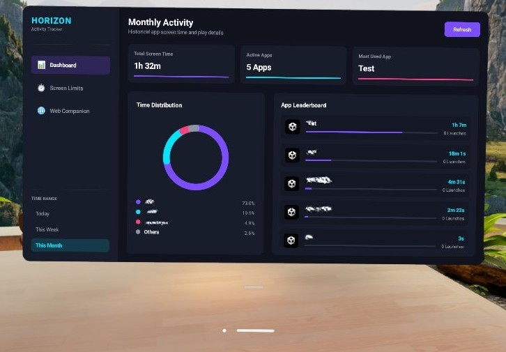
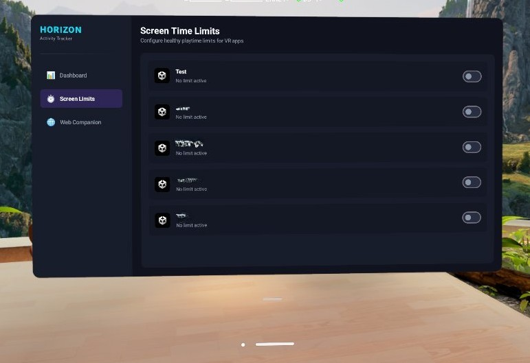
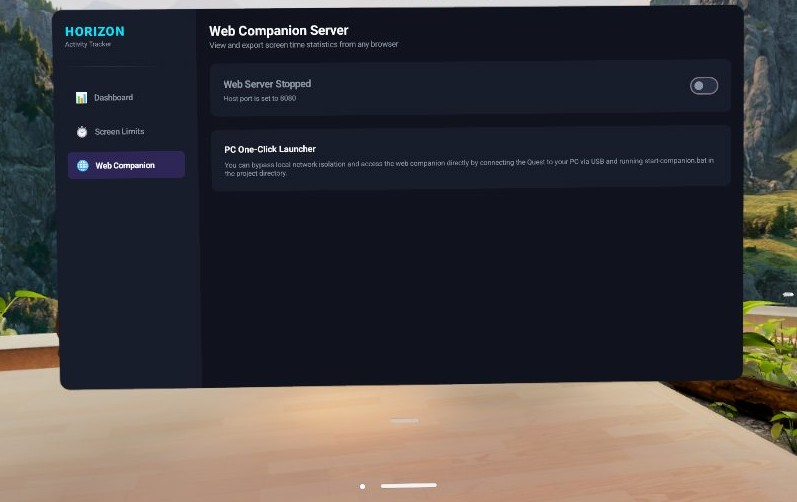

# Quest Activity Tracker

Quest Activity Tracker is a sideloaded, native 2D Android application designed for Meta Quest 3 and Quest 3S headsets running Horizon OS. It tracks, aggregates, and visualizes screen time usage metrics (playtime, launch counts, last active timestamp) for user applications and VR experiences.

The application features an embedded **Web Companion Server** that serves an interactive statistics dashboard directly from your headset, allowing you to monitor and export usage data remotely.

---

## 📷 Screenshots

| **Spatial Dashboard** | **Screen Limits** |
|:---:|:---:|
|  |  |

| **Web Companion Server** |
|:---:|
|  |

---

## Features

- 📊 **Screen Time Dashboard**: Visualizes overall screen time and active application metrics inside the headset.
- 🕒 **Time Range Filters**: Instantly switch views to see stats for **Today**, **This Week**, or **This Month**.
- 🍩 **Time Distribution Chart**: Dynamic circular progress canvas showing the percentage breakdown of active apps.
- 🏆 **App Leaderboard**: Lists applications ranked by foreground time, displaying launch counts and last-used timestamps.
- ⚙️ **Usage Limits**: Set custom usage alerts per app (limits are persistent using `SharedPreferences`).
- 🔍 **Intelligent System App Filtering**: Excludes background VR system components, services, and shell interfaces, keeping the focus entirely on your actual games and tools.
- 🌐 **Web Companion Dashboard**: A browser-based companion app served directly by a background Ktor server running on the headset. Includes:
  - Responsive visual styling matching the VR app's glassmorphic dark mode theme.
  - Interactive SVG donut charts and application search filter.
  - **JSON & CSV Export Utilities**: Download playtime stats directly to your local computer/device.

---

## Project Structure

```
quest-activity-tracker/
├── app/
│   ├── src/
│   │   └── main/
│   │       ├── assets/web/                  # Web companion HTML, CSS, and JS assets
│   │       ├── java/com/meta/quest/activitytracker/
│   │       │   ├── MainActivity.kt          # Entry point and permission check
│   │       │   ├── service/
│   │       │   │   └── UsageServerService.kt# Background Ktor server running Netty
│   │       │   ├── model/
│   │       │   │   ├── AppUsageInfo.kt      # Playtime & launch count model
│   │       │   │   └── UsageTrackerHelper.kt# Querying UsageStatsManager & filtering
│   │       │   └── ui/
│   │       │       └── ScreenTimeDashboard.kt# Compose UI navigation tabs & charts
│   │       ├── res/                         # UI layouts and themes configurations
│   │       └── AndroidManifest.xml          # Spatial panel manifest & permissions
│   └── build.gradle.kts                     # App-level dependencies
├── docs/assets/                             # Screenshots and visual media
├── build.gradle.kts                         # Project build script
├── settings.gradle.kts                      # Gradle subprojects configuration
├── start-companion.bat                      # PC one-click companion launcher
├── README.md                                # User manual
└── agents.md                                # AI Agent context & technical guide
```

---

## Build & Deploy Instructions

### Prerequisites
- Android Studio or Android SDK Command-line tools.
- Meta Quest 3 or Quest 3S headset connected with Developer Mode enabled.
- ADB (Android Debug Bridge) or `hzdb` installed and configured.

### 1. Build the Application
Compile the debug package using the Gradle Wrapper from the repository root:
```powershell
.\gradlew.bat assembleDebug
```

### 2. Sideload the APK
Install the built package directly onto your connected Quest device:
```powershell
adb install -r app/build/outputs/apk/debug/app-debug.apk
```

### 3. Grant Screen Time Permission
Since `UsageStatsManager` accesses sensitive activity logs, Horizon OS requires manual granting of the permission via ADB (re-installing the app resets this setting):
```powershell
adb shell appops set com.autovrse.quest.activitytracker android:get_usage_stats allow
```

### 4. Launch the App
Run the activity tracker from your Quest UI under **Library -> Unknown Sources**, or execute the following ADB start command:
```powershell
adb shell am start -n com.autovrse.quest.activitytracker/.MainActivity
```

---

## Accessing the Web Companion

The Web Companion is served directly from the headset by a background service. To use it:

1. Open the **Web Companion** tab in the Quest Activity Tracker app.
2. Toggle the **Web Server Switch** to **ON**.
3. Access the dashboard from your PC/phone using one of these options:

### Option A: Direct Local Wi-Fi (Same Network)
Navigate your browser to the resolved IP address shown on the Quest screen:
```
http://<headset-ip>:8080
```
*(Note: Both devices must be connected to the same local Wi-Fi network and client isolation must be disabled on the router.)*

### Option B: USB One-Click PC Launcher (Bypass Network Restrictions)
If your Wi-Fi router blocks client-to-client connections, you can connect the Quest to your PC via USB and run the companion script:
```powershell
.\start-companion.bat
```
This automatically establishes port forwarding (local `8080` -> Quest `8080`) and opens `http://localhost:8080` in your web browser.

---

## Data Exporting

The Web Companion dashboard features two export utilities at the bottom-left panel:
- 📥 **Export to CSV**: Downloads a spreadsheet containing application name, package name, total foreground time (in seconds), launch counts, and last active timestamp.
- 💾 **Export to JSON**: Downloads a structured raw JSON array containing the raw database response for custom scripts and analysis.
